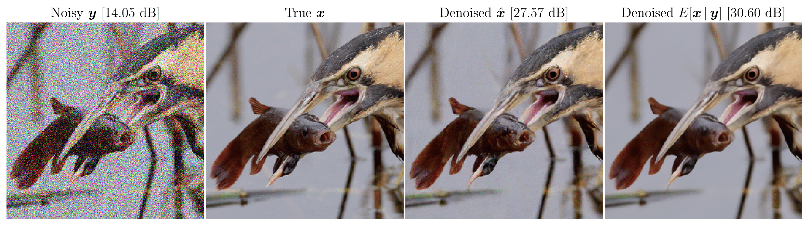

## Training and testing code for Gibbs-Diffusion (GDiff)
*Listening to the Noise: Blind Denoising with Gibbs-Diffusion*, [David Heurtel-Depeiges](https://david-heurtel-depeiges.github.io/), [Charles Margossian](https://charlesm93.github.io/), [Ruben Ohana](https://rubenohana.github.io/), [Bruno Régaldo-Saint Blancard](https://users.flatironinstitute.org/~bregaldosaintblancard/)

Center for Computational Mathematics, Flatiron Institute, New York City, USA


Link to the paper: ARXIV


#### TL;DR: we propose a image blind denoiser that also infers the parameters of the noise. The method is a Gibbs Sampler based on sampling from a pre-trained Diffusion model and an HMC step.

<p align="center">

</p>

## Installation

Prerequisites:

-  Python >= 3.9.15
-  Pytorch >= 1.13 (we recommend to use a >2.0 version)
-  Pytorch-Lightning >= 2.1.0
-  Cuda >= 11.6 (we recommend to use a >12.0 version)
-  bm3d >=4.0.1 (for benchmarking against BM3D, not used in Gibbs-Diffusion)

We provide two models pre-trained on ImageNet training set. The first one is trained on 5000 diffusion steps, while the second one, slower but better, is trained on 10,000 diffusion steps. They are available on this [Google Drive](https://drive.google.com/drive/folders/1E31OXJ9zZM3JzK9bsXsQFzFL16CPPCfN?usp=sharing) (create a folder ```model_checkpoints``` and download the two google drive folders in it). Weights should be added to HuggingFace soon.

## Usage

### Training
To train the model, first you should download ImageNet and adjust the paths in ```gdiff_utils.data.py``` for the ImageNet_train_dataset and ImageNet_val_dataset. You can train the model on your own dataset, just add it into ```gdiff_utils.data.py```

**WANDB**: if you want to use Weight and Biases to follow the training, modify `wandb_logger` in `train.py`. If you don't want to use WANDB, set '--wandb=False' when launching the training.
You can train on a **single GPU** using the following command:
```python
python train.py
```

To train on **multiple-GPUs** using DDP with Lightning, you can use (exampale given for an 8 GPUs node):
```python
torchrun --standalone --nproc_per_node=8 train.py --n_devices 8
```

Here are the details about some key arguments for training:
- `--diffusion_steps`: The number of diffusion steps of the diffusion model. The more the better, but the longer the inference.
- `--dataset_choice`: By default it is ImageNet (that you should download), but you can use directly `cbsd68`, `mcmaster` or `kodak24` that we provide in this repository.
- `--wandb`: Set to True to use weight and biases.
- `enable_ckpt`: enables saving the checkpoint of the model after `--max_epochs`.
- `load_model`: load a pre-trained model. If set to `True`, then you are doing finetuning.

Training our models on 100 epochs of ImageNet took about 40 hours on a single node of 8 H100-80GB.

### Blind denoising
Once you have either downloaded the pre-trained models on ImageNet, or trained your own model, you can either denoise a single image in the notebook `blind_denoising_example.ipynb`, or launch the following script to denoise on whole dataset of your choice:
```python
python denoise.py
```
Note: to compare with DnCNN or other models, you should download the weights [here](https://github.com/cszn/KAIR/tree/master/model_zoo).


## Contributing
If you enconter problems using Gibbs-Diffusion or have a feature request, feel free to create an issue!

## Citation
```
Add citation once the paper is released.
```


