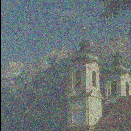
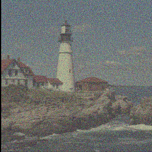

# Listening to the Noise: Blind Denoising with Gibbs Diffusion (GDiff)

This repository implements GDiff for the blind denoising of natural images, as described in our paper [Listening to the Noise: Blind Denoising with Gibbs Diffusion](https://arxiv.org/abs/2402.19455)

by [David Heurtel-Depeiges](https://david-heurtel-depeiges.github.io/), [Charles Margossian](https://charlesm93.github.io/), [Ruben Ohana](https://rubenohana.github.io/), and [Bruno Régaldo-Saint Blancard](https://bregaldo.github.io/)

*Center for Computational Mathematics, Flatiron Institute, New York*

--------------------

We introduce GDiff, a blind denoising method addressing posterior sampling of both signal and noise parameters, with applications in natural image denoising and cosmology. GDiff relies on a Gibbs sampler that alternates sampling steps with a pretrained diffusion model and a Hamiltonian Monte Carlo sampler.

Concretely, given a noisy observation $y = x + \varepsilon$, with $\varepsilon \sim \mathcal{N}(0, \Sigma_\phi)$, GDiff enables the sampling of the posterior distribution $p(x, \phi \mid y)$ for arbitrary diffusion-based signal prior $p(x)$.

We showcase our method for the denoising of natural images in the case of colored noises with unknown amplitude $\sigma$ and spectral exponent $\varphi$.

  *Example of blind denoising on a noisy ImageNet sample (the signal prior is learned on ImageNet):*
<p align="center">

</p>

*The same prior remains relevant for the denoising of noisy BSD68 and Kodak24 images (*$\sigma = 0.2$ *and* $\varphi \in \{-0.4, 0, 0.4\}$*):*

  

## Installation

We recommend using an environment with Python >= 3.9 and PyTorch >= 2.0 (see [installation instructions](https://pytorch.org/)). GPU acceleration would require CUDA >= 11.6.

In the relevant environment, run:
```
pip install -r requirements.txt
```

To download the pretrained models:
```
gdown --folder --id 1E31OXJ9zZM3JzK9bsXsQFzFL16CPPCfN -O model_checkpoints
```
This will download two diffusion models pretrained on ImageNet in a discrete time setting. The first one is trained with 5,000 diffusion steps, while the second one, slower but more refined, is trained with 10,000 diffusion steps.

You can alternatively download the models on this [Google Drive](https://drive.google.com/drive/folders/1E31OXJ9zZM3JzK9bsXsQFzFL16CPPCfN?usp=sharing). Make sure to put them in a folder called ```model_checkpoints```.

## Usage

### Training

We train the diffusion model via the `train.py` script. For training on ImageNet, you would need to download ImageNet and update the paths in ```gdiff_utils/data.py``` (`ImageNet_train_dataset` and `ImageNet_val_dataset`). You can also train the model on your own dataset, just follow the structure of ```gdiff_utils/data.py```.

**W&B**: Weight & Biases credentials need to be updated in `train.py/wandb_logger`. Alternatively, you can disable W&B logging setting `--wandb=False` when running the script.

Training on a **single GPU** can be simply run with:
```python
python train.py
```

To train on **multiple GPUs** using DDP with Lightning, you can use (e.g., for a node with 8 GPUs):
```python
torchrun --standalone --nproc_per_node=8 train.py --n_devices 8
```

We highlight a few key arguments of the training script:
- `--diffusion_steps`: The number of diffusion steps of the diffusion model. The more the better, but also the longer the inference.
- `--dataset_choice`: By default it is ImageNet (that you should download), but you can use directly `cbsd68`, `mcmaster` or `kodak24`, which we provide in this repository.
- `--wandb`: Set to True to use W&B.
- `--enable_ckpt`: saves the model after `--max_epochs`.
- `--load_model`: load a pre-trained model. Set to `True` for finetuning.

FIY, training on 100 epochs of ImageNet takes about 40 hours on a single node of 8 H100-80GB.

### Blind denoising

To perform blind denoising using a pretrained model or your own model, either follow the notebook `blind_denoising_example.ipynb` (example on a single image) or run `denoise.py` (for denoising on the whole dataset of your choice):
```python
python denoise.py
```
Note: For comparison with DnCNN, you will have to download the corresponding model [here](https://github.com/cszn/KAIR/tree/master/model_zoo).


## Contributing
If you encounter problems using GDiff or have a feature request, feel free to create an issue!

## Citation
```
@article{heurteldepeiges2024listening,
      title={Listening to the Noise: Blind Denoising with Gibbs Diffusion}, 
      author={David Heurtel-Depeiges and Charles C. Margossian and Ruben Ohana and Bruno {Régaldo-Saint Blancard}},
      year={2024},
      eprint={2402.19455},
      archivePrefix={arXiv},
      primaryClass={stat.ML}
}
```
