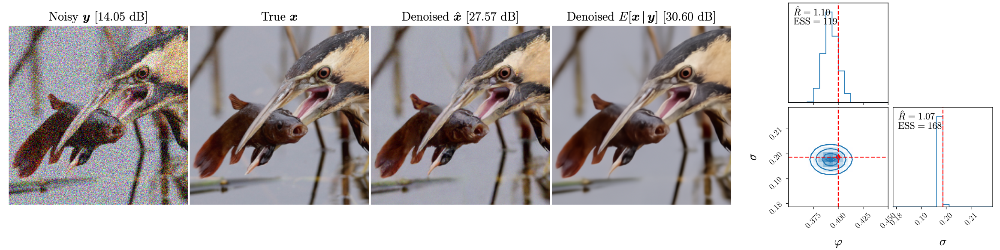

## Training and testing code for Gibbs Diffusion (GDiff)
*Listening to the Noise: Blind Denoising with Gibbs Diffusion*, [David Heurtel-Depeiges](https://david-heurtel-depeiges.github.io/), [Charles Margossian](https://charlesm93.github.io/), [Ruben Ohana](https://rubenohana.github.io/), [Bruno Régaldo-Saint Blancard](https://users.flatironinstitute.org/~bregaldosaintblancard/)

Center for Computational Mathematics, Flatiron Institute, New York City, USA


Link to the paper: ARXIV

#### TL;DR: We introduce GDiff, a blind denoising method addressing posterior sampling of both signal and noise parameters, with applications in natural image denoising and cosmology. GDiff relies on a Gibbs sampler that alternates sampling steps with a pretrained diffusion model and a Hamiltonian Monte Carlo sampler.

<p align="center">

</p>

  

**[Blind denoising using GDiff** for a noise level of $\sigma = 0.2$ and different colors of noise, i.e. $\varphi \in \{-0.4, 0, 0.4\}$ for CBSD68 and Kodak24.] 

## Installation

We recommend using an environment with Python >= 3.9.15 and PyTorch >= 2.0 (see [installation instructions](https://pytorch.org/)). GPU acceleration would require CUDA >= 11.6.

In the relevant environment, run:
```
pip install -r requirements.txt
```

To download the pretrained models, run:
```
gdown --folder --id 1E31OXJ9zZM3JzK9bsXsQFzFL16CPPCfN -O model_checkpoints
```
This will download two diffusion models pretrained on ImageNet using discrete timestepping. The first one is trained with 5,000 diffusion steps, while the second one, slower but more refined, is trained with 10,000 diffusion steps.

You can alternatively download the models on this [Google Drive](https://drive.google.com/drive/folders/1E31OXJ9zZM3JzK9bsXsQFzFL16CPPCfN?usp=sharing). Make sure to put them in a folder called ```model_checkpoints```. We also plan to upload the weights on HuggingFace soon.

## Usage

### Training
To train the model, first you should download ImageNet and adjust the paths in ```gdiff_utils.data.py``` for the ImageNet_train_dataset and ImageNet_val_dataset. You can train the model on your own dataset, just add it into ```gdiff_utils.data.py```

**WANDB**: if you want to use Weight and Biases to follow the training, modify `wandb_logger` in `train.py`. If you don't want to use WANDB, set '--wandb=False' when launching the training.
You can train on a **single GPU** using the following command:
```python
python train.py
```

To train on **multiple-GPUs** using DDP with Lightning, you can use (e.g., for a node with 8 GPUs):
```python
torchrun --standalone --nproc_per_node=8 train.py --n_devices 8
```

Here are the details about some key arguments for training:
- `--diffusion_steps`: The number of diffusion steps of the diffusion model. The more the better, but the longer the inference.
- `--dataset_choice`: By default it is ImageNet (that you should download), but you can use directly `cbsd68`, `mcmaster` or `kodak24` that we provide in this repository.
- `--wandb`: Set to True to use weight and biases.
- `enable_ckpt`: enables saving the checkpoint of the model after `--max_epochs`.
- `load_model`: load a pre-trained model. If set to `True`, then you are doing finetuning.

Training our models on 100 epochs of ImageNet took about 40 hours on a single node of 8 H100-80GB.

### Blind denoising
Once you have either downloaded the pre-trained models on ImageNet, or trained your own model, you can either denoise a single image in the notebook `blind_denoising_example.ipynb`, or launch the following script to denoise on whole dataset of your choice:
```python
python denoise.py
```
Note: to compare with DnCNN or other models, you should download the weights [here](https://github.com/cszn/KAIR/tree/master/model_zoo).


## Contributing
If you encounter problems using GDiff or have a feature request, feel free to create an issue!

## Citation
```
Add citation once the paper is released.
```


